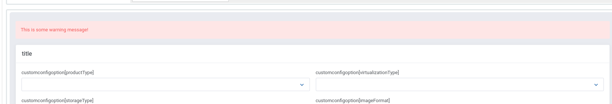

### Przygotowanie
1. Zacznij od stworzenia struktury podobnie jak ma to miejsce w przypadku addon module
2. Zainstaluj framework poprzez composer i uruchom skrypt `fw-install` 
3. Skonfiguruj potrzebne paczki oraz obowiązkowo włącz paczkę `Product`
4. Klasy dla modułu znajdziesz w katalogu `app/Http/Actions/`. 
5. Przygotuj konfigurację modułu, akcje odpowiedzialna za to znajduje się w pliku `ConfigOptions`. W większości przypadków nie ma potrzebny abyś edytował plik, wszystkie swoje zmiany powinieneś umieścić w `app/UI/Actions/ConfigOptions.php`. Jeżeli potrzebujesz możesz ten rozszerzyć domyślnego providera. 
6. Akcje takie jak create/terminate/suspend etc, implementujesz w `app/Http/Actions/`


### Pokazywanie własnych błędów 
W klasie `ConfigOptions` która dziedziczy po `ModulesGarden\OpenStackVpsCloud\Packages\Product\UI\Forms\ProductConfiguration` możesz dodawać własne elementy UI. Możesz je przykładowo wyświetlić tak: 
```php

        $alert = new AlertDanger();
        $alert->setText('This is some warning message!');
        $this->builder->addElement($alert);
```
co spowoduje wyświetlenie:




### Pokazywanie błędów krytycznych
Jeżeli pojawił się błąd krytyczny i chcemy tylko jego wyświetlić możemy to zrobic poprzez rzucenie wyjątku 
```php
        throw new \Exception('This is some warning message!');
```