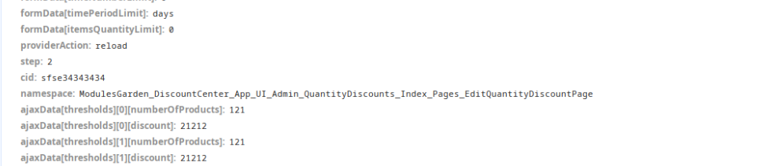

### Przekazywanie danych pomiędzy komponentami

**Przypadek użycia**: Zbieramy informacje w jednym komponencie, ale chcemy finalnie wszystko przekazać do innego.\
`Uwaga!:` Dane nie są przekazywane jako dane w `formData` ale w `ajaxData`

1. Nadaj ID elementowi do którego chcesz przekazać dane

```php
class EditQuantityDiscountPage extends CreateQuantityDiscountPage
{

    protected string $provider = EditQuantityDiscountProvider::class;
    protected string $providerAction = CrudProvider::ACTION_UPDATE;
    protected string $cid = 'my-id';
}
```

2. Element który będzie przekazywał dane musi nam zwrócić akcje, w `Response`. W zależności od komponentu `Response` mamy dostępne domyślnie lub musi wybrać z rodzica. Poniży przykład tyczy sie drugiej opcji kiedy to rodzic (DataTable) zwraca juz gotowe `Response`:

```php
    public function returnAjaxData(): ResponseInterface
    {
        return parent::returnAjaxData()->setActions([
            (new PassAjaxData((new EditQuantityDiscountPage)->getId(), [
                'thresholds' => $this->records
            ]))]);
    }
```

3. Finalnie kiedy element `EditQuantityDiscountPage` zostanie wysłany będzie zawierał dodatkowe parametry\
   {width="722" height="159"}