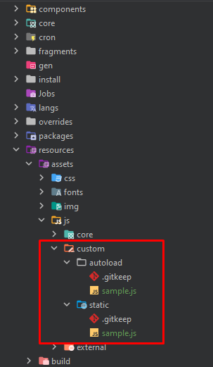
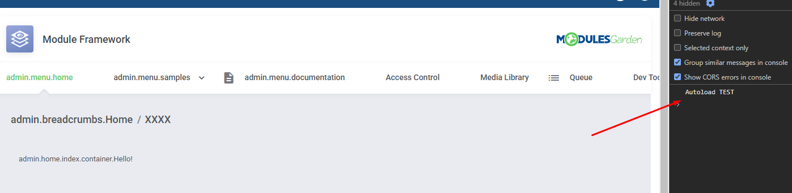
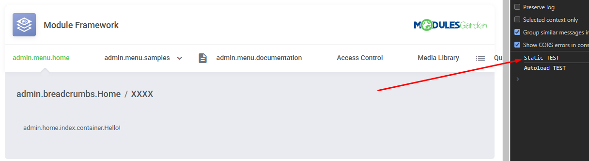

Framework udostępnia wsparcie Customowym JSom.

Ważne jest żeby umieścić je w folderze `\resources\assets\js\custom` inaczej zostaną wyzerowane przy najbliższym updacie frameworka.

Do dyspozycji mamy dwa foldery w `\resources\assets\js\custom` - `autoload` i `static` 

JSy wrzucone do katalogu `autoload` zostaną załadowane automatycznie tak jak np. biblioteki z core <br>
JSy wrzucone do katalogu `static` nie zostaną załadowane automatycznie i trzeba się samemu do nich odwołać

Przykład:

Mam dwa JSy odpowiednio w katalogu `autoload` i `static` 



\resources\assets\js\custom\autoload\sample.js

```js
$( document ).ready(function() {
    console.log( "Autoload TEST" );
});
```

\resources\assets\js\custom\static\sample.js

```js
console.log( "Static TEST" );
```

Zaraz po uruchomieniu modułu pokaże się log tylko z autoloada



Do JSów ze `static` trzeba się odnieść np.: 

w hooku `AdminAreaFooterOutput`

```php
<?php

use ModulesGarden\OpenStackVpsCloud\Core\Helper\BuildUrl;

$hookManager->register(
    function($args) {

        $staticUrl = BuildUrl::getAssetsURL("js", "custom", "static");

        return '<script type="text/javascript" src="' . $staticUrl . '/sample.js"></script>';
    },
    100
);
```

