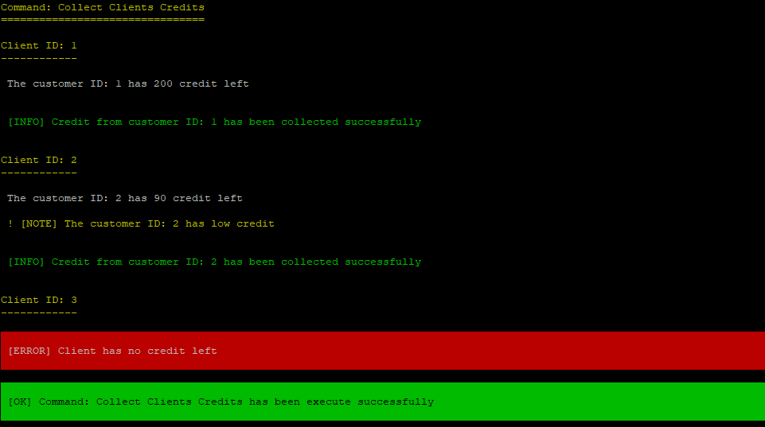

## Printowanie komunikatów

#### TYTUŁ

```php
$io->title();
```

#### CONTENT 

##### Jeżeli komenda jest podzielona na sekcje np. Scheduler lub BackupSync z Proxmoxa to poprzedzamy ją tytułem w :

```php
$io->section('Section title');
```

Success wewnętrzny <br>
```php
$io->info('Some section done with success');
```

Informacje wewnętrzne <br>
```php
$io->text('Lorem ipsum dolor sit amet');
```

Ostrzeżenia np. Hosting not found <br>
```php
$io->note('Hosting not found');
```

Błędy wewnętrzne <br>
```php
$io->error('Some error occured');
```

#### INFO

Czyli generalna informacja np. No Commands found, No Backups itp

```php
$io->info("No Commands found");
```

#### SUCCESS

```php
$io->success("Some success");
```

#### ERROR

```php
$io->error("SOme error occured");
```

#### CRITICALE i ważne errory

```php
$io->caution("Critical error");
```

#### WARNINGI

```php
$io->warning("Some warning");
```

Link po więcej szczegółów

https://symfony.com/doc/current/console/style.html

### Przykład

Komenda która pobiera kredyty od klientów

```php
    protected function process(InputInterface $input, OutputInterface $output, SymfonyStyle $io)
    {
        $io->title('Command: Collect Clients Credits');

        if (empty($this->clientIds))
        {
            $io->info("No clients were found");
        }

        if (count($this->clientIds) > 1000)
        {
            $io->warning("Too many clients found");
        }

        foreach ($this->clientIds as $clientId)
        {
            $io->section('Client ID: ' . $clientId);

            try
            {
                $creditsRemaining = $this->takeSomeCreditsFromClient($clientId);

                $io->text('The customer ID: ' . $clientId . ' has ' . $creditsRemaining . ' credit left');

                if ($creditsRemaining < 100)
                {
                    $io->note('The customer ID: ' . $clientId . ' has low credit');
                }

                $io->info("Credit from customer ID: " . $clientId . " has been collected successfully");
            }
            catch (\Exception $e)
            {
                $io->error($e->getMessage());
            }
        }

        $io->success('Command: Collect Clients Credits has been execute successfully');
    }
```

Wynik w konsoli:


