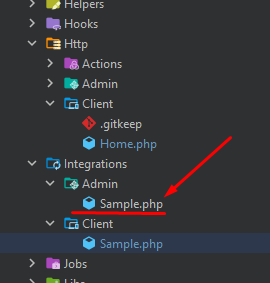
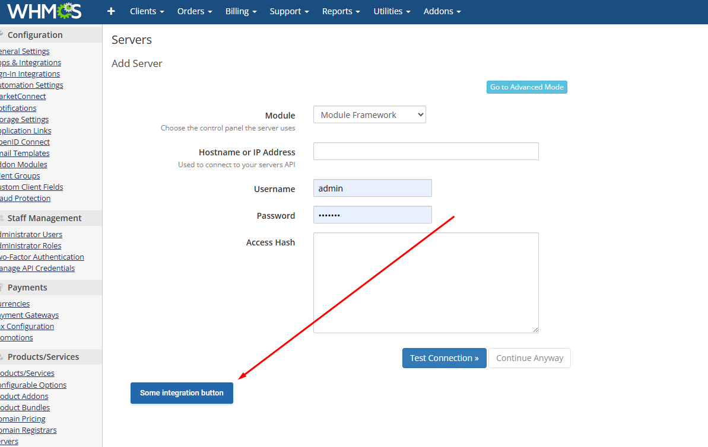

Integracja służą do wstrzykiwania frameworka w określone strony w określonych warunkach.\
Przykładowo może wstrzyknąć na podstawie aktualnych parametrów GET/POSt, określić miejsce wstrzyknięcia itp.

### Implementacja

##### Cel
Dodanie buttona na stronę dodawania serwera

1. Utwórz klasę w katalogu `Integrations/Admin`  lub `Integrations/Client` która dziedziczy po `ModulesGarden\OpenStackVpsCloud\Core\Hook\AbstractHookIntegrationController`




```php

use ModulesGarden\OpenStackVpsCloud\App\Http\Admin\Home;
use ModulesGarden\OpenStackVpsCloud\Core\Hook\AbstractHookIntegrationController;
use ModulesGarden\OpenStackVpsCloud\Core\Hook\Integration\Enums\IntegrationTypes;
use ModulesGarden\OpenStackVpsCloud\Core\Hook\Integration\Integration;
use ModulesGarden\OpenStackVpsCloud\Core\Hook\Integration\Models\ControllerCallback;
use ModulesGarden\OpenStackVpsCloud\Core\Hook\Integration\Models\RelatedField;

class Sample extends AbstractHookIntegrationController
{
    public function __construct()
    {
        $this->setIntegration(
            (new Integration(new ControllerCallback(Home::class, 'test'), '#preAddForm'))
                ->requireFile('configservers')
                ->requireGetFields(['action' => 'manage'])
                ->setType(IntegrationTypes::Append)
                ->dependentOnFormField(new RelatedField("#addType", ["OpenStackVpsCloud"]))
        );
    }
}
```

2. Stwórz klasę/kontroller który zwraca widok

```php
namespace ModulesGarden\OpenStackVpsCloud\App\Http\Admin;

use ModulesGarden\OpenStackVpsCloud\Components\Button\ButtonPrimary;
use ModulesGarden\OpenStackVpsCloud\Core\Contracts\Controllers\AdminAreaInterface;
use ModulesGarden\OpenStackVpsCloud\Core\Http\AbstractController;
use function ModulesGarden\OpenStackVpsCloud\Core\Helper\viewIntegrationAddon;

class Home extends AbstractController implements AdminAreaInterface
{
    public function test()
    {
        return viewIntegrationAddon()
            ->addElement((new ButtonPrimary())->setTitle("Some integration button"));
    }
}
```

Dodana integracja:



Dodatkowe informacje:

`Integration::dependentOnFormField()` - to metoda która przyjmuje klasę `RelatedField($selectorZależnegoPola, [$wartości])` . Sprawia że nasza integracja pokazuje się tylko kiedy zależne pole wybrane selectorem przyjmuje jedną z zadeklarowanych wartości

