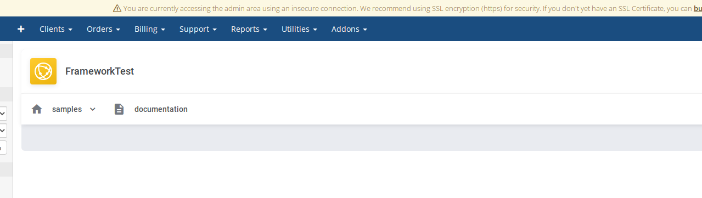
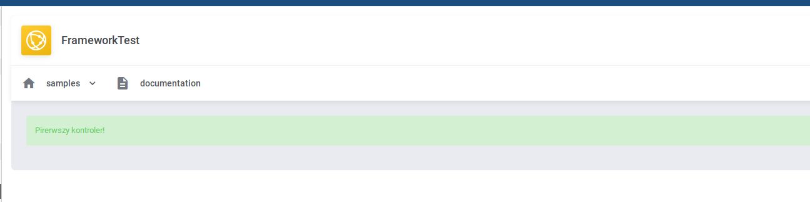
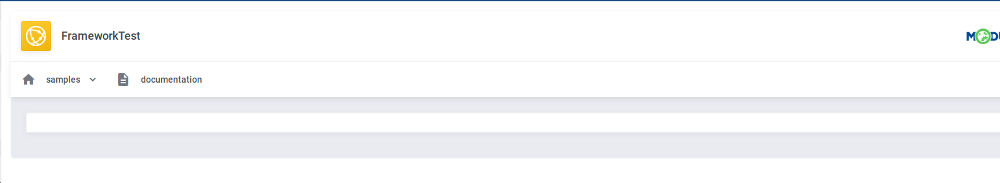
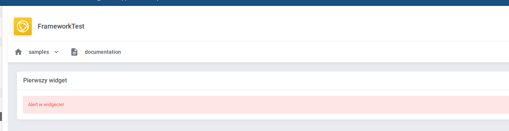

Poniżej znajdziesz szybkie wprowadzanie, które pozwoli Ci zbudować `addon module` lub `provisonig module` bez wnikania w to jak cały system działa.   
Szczegółowe informacje znajdziesz w określonych sekcjach, które są podlinkowane sidebarze. 

### Dokumentacja PHP
Znajdziesz ją tutaj: http://whmcs-products.internal.modulesgarden.com/module-framework/

### Urchomienie szkieletu modułu
1. Utwórz katalog z nazwą swojego modułu. Przykładowo `modules/servers/FrameworkTest` lub `modules/addons/FrameworkTest`. 
2. Utwórz plik composer.json
```json
{
   "repositories":[
      {
         "type":"vcs",
         "url":"git@git.mglocal:whmcs-products/module-framework.git"
      }
   ],
   "require":{
      "modulesgarden/whmcs-framework":"*"
   },
  "scripts": {
    "fw-install": [
      "\\ModulesGarden\\OpenStackVpsCloud\\Install\\Installer::run"
    ]
  },
  "autoload": {
    "psr-4": {
      "ModulesGarden\\NAZWA_TWOJEG_MODULU\\Core\\": "./core",
      "ModulesGarden\\NAZWA_TWOJEG_MODULU\\App\\": "./app",
      "ModulesGarden\\NAZWA_TWOJEG_MODULU\\Packages\\": "./packages",
      "ModulesGarden\\NAZWA_TWOJEG_MODULU\\Fragments\\": "./fragments",
      "ModulesGarden\\NAZWA_TWOJEG_MODULU\\Components\\": "./components",
      "ModulesGarden\\NAZWA_TWOJEG_MODULU\\Install\\": "./install"
    }
  }
}
```
3. Uruchom polecenie `composer install`. Możesz też w PhpStorm kliknąc prawym na pliku `composer.json` i wybrać `Composer` -> `Install`.
4. Uruchome polecenie `composer run-script fw-install`, które spowoduje przenienie plików oraz aktualizacje przestrzenii nazw. 
5. Wgraj plik do głównego katalogu WHMCS
6. Aktywuj moduł `FrameworkTest`
7. Brawo! Skonfigurowałeś domyślną konfiguracja frameworka. jest tam sporo rzeczy które nie są Ci potrzebne i które musisz usunąć przed dostarczeniem modułu, ale tym się zajmiemy niedługo ;)

### Konfiguracja domyślnych paczek 
Podstawowa konfiguracja frameworka zawiera sporą ilość paczek, które są wykorzystywane do developmentu oraz testowania frameworka. 
Jest tam też wiele przykładów, które możesz wykorzystać w swojej aplikacji.   
Zacznijmy od wyłączenia paczek, które nie są Ci potrzebne. 
Możesz to zrobić w pliku `modules/servers/FrameworkTest/app/Config/packages.yml` zmieniając wartość `true` na `false` lub po prostu usuwając daną linie.
Przykładowy plik konfiguracyjny może wyglądać tak
```yml
AccessControl: true
Samples: true
Logs: true
ModuleSettings: true
RequirementsChecker: true
```
Na początek proponuje wyłączyc wszystkie poza "Samples", które zawiera przykładowe elementy UI, które wykorzystasz później do budowania aplikacji. 

### Pierwszy kontroler 
Na start musi zacząć od ustawienia domyślnej zawartości dla kontrolera `Home`, który jest ładowany jeżeli nie podano żadnego parametru w URL.   
Znajduje się on w katalogu `app/Http/Admin` i wygląda on mniej wiecej tak
```php
<?php

namespace ModulesGarden\FrameworkTest\App\Http\Admin;

use ModulesGarden\FrameworkTest\Core\Http\AbstractController;
use function ModulesGarden\FrameworkTest\Core\Helper\view;

class Home extends AbstractController
{
    public function index()
    {
        return view();
    }
}
```
z rzeczy które nas interesują jest to metoda `index` która jest domyślną metodą każdego kontrolera.   
Ta metoda jest uruchamiana jeżeli w URL nie podano konkretnej metody kontrolera.
Niestety, mimo że mamy kontroler to ciągle nic on nie robi. 
 
   

W celu wyświetlenia elementów UI należy pierw taki element dodać. W tym celu wykorzystam komponent `Alert`   
```php
<?php

namespace ModulesGarden\FrameworkTest\App\Http\Admin;

use ModulesGarden\FrameworkTest\Components\Alert\AlertSuccess;
use ModulesGarden\FrameworkTest\Core\Http\AbstractController;
use function ModulesGarden\FrameworkTest\Core\Helper\view;

class Home extends AbstractController
{
    public function index()
    {
        $alert = new AlertSuccess();
        $alert->setText('Pirerwszy kontroler!');

        return view()
            ->addElement($alert);
    }
}
```
co finalnie da nam   


Udało nam się coś wyświetlić, ale zaprezentowany sposób jest daleki od tego w jaki powinniśmy budować UI moduł i należy go unikać.   
W kolejnym rozdziale dowiesz się jak poprawnie budować UI. 
   
### UI 
Elementu UI należy umieszczać w katalogu `app/UI/Admin` lub `app/UI/Client`. Jeżeli dany element jest dostępny dla klienta oraz admina to warto go umieścić w osobnym katalogu `app/UI/Shared`. Dana strona może posiadać bardzo wiele elementów UI, więc dodamy trzy dodatkowe katalogi które będą nam mówiły o:
 - nazwie kontrolera jaki wykorzystuje dane element UI
 - metodzie kontrola która ładuje dany element UI
 - typie komponentu jaki wykorzystujemy
Nasz pierwszy element będzie dostępny tylko i wyłącznie w widoku administratora i będzie prosty Widgete-em, wiec stworzymy go w katalogu `app/UI/Client/Home/Index/Widgets` 
```php
<?php

namespace ModulesGarden\FrameworkTest\App\UI\Admin\Home\Index\Widgets;

use ModulesGarden\FrameworkTest\Components\Widget\Widget;

class Test extends Widget
{

}
```
następnie należy tak stworzony element załadować w kontrolerze który po modyfikacji będzie wyglądał tak:
```php
<?php

namespace ModulesGarden\FrameworkTest\App\Http\Admin;

use ModulesGarden\FrameworkTest\App\UI\Admin\Home\Index\Widgets\Test;
use ModulesGarden\FrameworkTest\Core\Http\AbstractController;
use function ModulesGarden\FrameworkTest\Core\Helper\view;

class Home extends AbstractController
{
    public function index()
    {
        return view()
            ->addElement(Test::class);
    }
}
```
Specjalnie tutaj nie tworzymy sami obiektu tylko pozwalamy zrobić to frameworkowi. Dzięki temu kod samego kontrolera jest znacznie czytelniejszy.   
Po wprowadzeniu zmian ponownie za wiele się w naszym module nie dzieje.   
   

Ponownie wracamy do Widgetu którego wcześniej utworzyliśmy i implementujemy metodę `loadHtml`, która odpowiada za zbudowanie wyglądu danego elementu.  
Ustawiamy w niej tytuł dane elementu oraz dodajemy komponenty typu Alert 
```php
<?php

namespace ModulesGarden\FrameworkTest\App\UI\Admin\Home\Index\Widgets;

use ModulesGarden\FrameworkTest\Components\Alert\AlertDanger;
use ModulesGarden\FrameworkTest\Components\Widget\Widget;

class Test extends Widget
{
    public function loadHtml(): void
    {
        $this->setTitle('Pierwszy widget');

        $alert = new AlertDanger();
        $alert->setText('Alert w widgecie!');
        $this->addElement($alert);
    }
}
```
co nam da:


### Ajax UI 
Jeżeli to co chcemy wyświetlić wymaga operacji, które mogą potrwać dłuższy czas, lub też chcemy nasz element UI odświeżyć (automatycznie lub cyklicznie) to musimy wykorzystać metode `loadData` oraz zaimplementować interfejs `AjaxOnLoad`. 
```php
<?php

namespace ModulesGarden\FrameworkTest\App\UI\Admin\Home\Index\Widgets;

use ModulesGarden\FrameworkTest\Components\Alert\AlertDanger;
use ModulesGarden\FrameworkTest\Components\Widget\Widget;
use ModulesGarden\FrameworkTest\Core\Contracts\Components\AjaxOnLoad;

class Test extends Widget implements AjaxOnLoad
{
    public function loadData(): void
    {
        $this->setTitle('Pierwszy widget');

        $alert = new AlertDanger();
        $alert->setText('Alert w widgecie!');
        $this->addElement($alert);
    }
}
```
idąc dalej, możemy też na naszym elemencie wymusisz auto odświeżanie co jedną sekunde (1000 ms)
```php
<?php

namespace ModulesGarden\FrameworkTest\App\UI\Admin\Home\Index\Widgets;

use ModulesGarden\FrameworkTest\Components\Alert\AlertDanger;
use ModulesGarden\FrameworkTest\Components\Widget\Widget;
use ModulesGarden\FrameworkTest\Core\Contracts\Components\AjaxAutoReload;
use ModulesGarden\FrameworkTest\Core\Contracts\Components\AjaxOnLoad;

class Test extends Widget implements AjaxOnLoad, AjaxAutoReload
{
    protected int $ajaxAutoReloadInterval = 1000;

    public function loadData(): void
    {
        $this->setTitle('Pierwszy widget');

        $alert = new AlertDanger();
        $alert->setText('Alert w widgecie! Aktualny timestamp: '.time());
        $this->addElement($alert);
    }
}
```
Zapewne już zauważyłeś, że po odświeżeniu strony nasz widget nie ma żadnej treści. Wynika to z tego że nie ustawiliśmy początkowej treści za pomocą metody `loadHtml`. Tak więc zaimplementujmy ją ponownie 

```php
<?php

namespace ModulesGarden\FrameworkTest\App\UI\Admin\Home\Index\Widgets;

use ModulesGarden\FrameworkTest\Components\Alert\AlertDanger;
use ModulesGarden\FrameworkTest\Components\Widget\Widget;
use ModulesGarden\FrameworkTest\Core\Contracts\Components\AjaxAutoReload;
use ModulesGarden\FrameworkTest\Core\Contracts\Components\AjaxOnLoad;

class Test extends Widget implements AjaxOnLoad, AjaxAutoReload
{
    protected int $ajaxAutoReloadInterval = 1000;

    public function loadHtml(): void
    {
        $this->setTitle('Pierwszy widget');
        $this->setContent('Loading...');
    }

    public function loadData(): void
    {
        $alert = new AlertDanger();
        $alert->setText('Alert w widgecie! Aktualny timestamp: ' . time());
        $this->addElement($alert);
    }
}
```